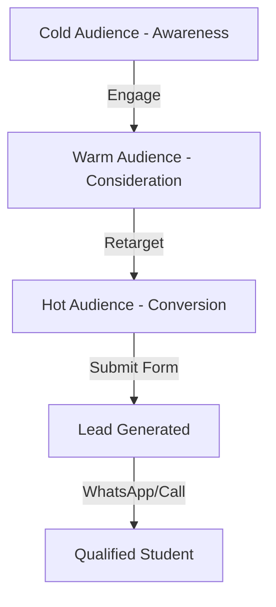

# Meta Marketing Plan - Study in China Lead Generation

## Executive Summary

This comprehensive Meta (Facebook & Instagram) marketing strategy is designed to generate high-quality leads for EduExpress International's **Study in China** program. The strategy leverages your unique selling propositions (Payment After Visa, Zero Tuition, No IELTS) to attract Bangladeshi students seeking affordable international education.

**Goal:** Generate 100-300 qualified leads per month with a target cost per lead (CPL) of ₹150-300 ($1.50-$3.00 USD)

---

## 🎯 Campaign Objectives

### Primary Goal
- **Lead Generation:** Collect qualified student information through the landing page form
- **Target:** 100-300 form submissions per month
- **Budget:** ₹30,000-50,000/month ($300-500 USD)

### Secondary Goals
- Build brand awareness among target audience
- Create engagement with educational content
- Retarget warm audiences for conversion
- Build lookalike audiences from high-quality leads

---

## 👥 Target Audience Strategy

### Primary Audience Segments

#### **Segment 1: SSC/HSC Students (Diploma Track)**
- **Age:** 16-20 years
- **Education:** Recently passed SSC, currently in HSC, or HSC failed/gap
- **Location:** Bangladesh (Dhaka, Chattogram, Sylhet, Rajshahi, Khulna priority)
- **Interests:** Study abroad, international education, scholarship programs
- **Pain Points:** Cannot afford expensive education, IELTS barrier, fear of visa rejection

#### **Segment 2: HSC+ Students (Bachelor Track)** ⭐ PRIMARY
- **Age:** 18-25 years
- **Education:** HSC passed, some college, or dropped out
- **Location:** Bangladesh (All major cities)
- **Interests:** China scholarship, study abroad without IELTS, free education
- **Pain Points:** High tuition costs, IELTS requirement, upfront consultant fees
- **Behavioral:** Searches for: "চায়নায় পড়াশোনা", "scholarship in China", "study abroad without IELTS"

#### **Segment 3: Bachelor Graduates (Masters Track)**
- **Age:** 22-30 years
- **Education:** Bachelor's degree holders
- **Location:** Bangladesh (Urban areas)
- **Interests:** Masters degree, research, AI, data science, engineering
- **Pain Points:** Want higher stipend, advanced research opportunities
- **Job Titles:** Recent graduate, teacher, junior engineer, entry-level positions

#### **Segment 4: Parents (Decision Influencers)**
- **Age:** 40-55 years
- **Parenting Status:** Parents with children aged 16-25
- **Location:** Bangladesh (All regions)
- **Interests:** Education, child's future, savings, investment
- **Pain Points:** Financial burden, safety concerns, education quality

---

## 📊 Campaign Structure

### **3-Tier Funnel Approach**



---

### Campaign 1: **AWARENESS** (Cold Traffic)

**Objective:** Reach & Brand Awareness

**Target Audience:**
- Cold audience matching demographics above
- Custom audiences based on interests and behaviors
- Never interacted with your page/content before

**Ad Formats:**
- **Video Ads** (15-30 seconds): Campus life, student testimonials, scholarship benefits
- **Carousel Ads:** Show 3 programs (Diploma, Bachelor, Masters) with unique benefits
- **Image Ads:** Eye-catching graphics highlighting "Payment After Visa" USP

**Budget Allocation:** 40% of total budget

**Placements:**
- Facebook Feed
- Instagram Feed & Stories
- Facebook Reels
- Instagram Reels

**Key Messages:**
- "চায়নায় ১০০% ফ্রি স্কলারশিপ - ভিসার পর পেমেন্ট"
- "No IELTS Required - SSC থেকে Masters"
- "Monthly Stipend ৳10,000-৳60,000"

---

### Campaign 2: **CONSIDERATION** (Warm Traffic)

**Objective:** Traffic & Engagement

**Target Audience:**
- Engaged with awareness ads (video views 25%+, reactions, comments, shares)
- Visited landing page but didn't submit form
- Facebook/Instagram page engagers (last 30 days)
- Video viewers (watched 50%+ of awareness videos)

**Ad Formats:**
- **Educational Carousel:** Detail complete support package (6 steps)
- **Testimonial Videos:** Success stories from current students
- **Infographic Ads:** Scholarship breakdown, eligibility criteria
- **Lead Form Ads:** Direct form submission on Facebook (backup to landing page)

**Budget Allocation:** 30% of total budget

**Placements:**
- Facebook Feed
- Instagram Feed
- Messenger inbox ads
- Facebook Right Column (desktop)

**Key Messages:**
- "শুরু থেকে শেষ পর্যন্ত সম্পূর্ণ সাপোর্ট"
- "১০০০+ Students Successfully Placed Since 2018"
- "Free CSCA Exam Preparation + Airport Pickup"

---

### Campaign 3: **CONVERSION** (Hot Traffic)

**Objective:** Lead Generation/Conversions

**Target Audience:**
- Landing page visitors (last 7-14 days) who didn't convert
- Form abandoners (started but didn't complete)
- High engagement users (commented, saved, shared)
- Website custom audience with pixel events (ViewContent)

**Ad Formats:**
- **Direct Response Ads:** Strong CTA with urgency
- **Dynamic Retargeting:** Show exact program they viewed
- **Messenger Ads:** Enable instant conversation
- **Lead Form Ads:** Simplified 4-field form on platform

**Budget Allocation:** 30% of total budget

**Placements:**
- Facebook Feed (priority)
- Instagram Feed (priority)
- Facebook Marketplace
- Messenger

**Key Messages:**
- "⏰ March Intake - Limited Seats!"
- "আজই যোগ্যতা যাচাই করুন - সম্পূর্ণ ফ্রি"
- "100% Risk-Free - Payment ONLY After Visa"

---

## 🎨 Creative Strategy

### Visual Guidelines

**Color Palette:**
- **Primary:** Red (#DC2626) - Urgency, action
- **Secondary:** Green (#10B981) - Trust, approval, money
- **Accent:** Yellow (#FFB800) - Attention, scholarship
- **Supporting:** Blue (#3B82F6) - Education, trust

**Image Requirements:**
- **Aspect Ratios:** 
  - Feed: 1:1 (1080x1080px)
  - Stories: 9:16 (1080x1920px)
  - Reels: 9:16 (1080x1920px)
  - Carousel: 1:1 (1080x1080px each)

**Visual Elements:**
- Real photos of Chinese universities and campuses
- Bangladeshi students in China (if available)
- Chinese flag 🇨🇳 + Bangladesh flag 🇧🇩
- Money/scholarship icons 💰 📚
- Trust badges (Since 2018, 1000+ students)

### Video Creative Framework

#### **Video 1: Problem-Solution Hook (15 sec)**
```
Hook (0-3s): "বিদেশে পড়তে চান কিন্তু IELTS + লক্ষ টাকা খরচ?"
Problem (3-7s): Show pain points with sad/stressed student
Solution (7-12s): "চায়নায় ১০০% ফ্রি + Payment After Visa"
CTA (12-15s): "Free Assessment করুন আজই"
```

#### **Video 2: Student Testimonial (30 sec)**
```
Introduction (0-5s): Student introduces themselves
Journey (5-20s): How they got scholarship, no IELTS needed
Benefits (20-25s): Free tuition, stipend, support
CTA (25-30s): "You can do it too - Apply now"
```

#### **Video 3: Campus & Lifestyle (20 sec)**
```
Visuals: Beautiful campus shots, modern facilities
Overlay Text: "Top 100 University", "Monthly Stipend", "Global Career"
Background Music: Uplifting, aspirational
CTA: "Start Your Journey - Check Eligibility"
```

### Ad Copy Templates

#### **Template 1: Pain-Agitate-Solution (PAS)**
```
🚨 বিদেশে পড়তে চান কিন্তু এই সমস্যাগুলো থামিয়ে রাখছে?

❌ লক্ষ টাকা টিউশন ফি
❌ IELTS স্কোর লাগবে
❌ ভিসার আগেই কনসালট্যান্সি ফি
❌ Visa rejection-এর ভয়

✅ চায়নায় এসব সমস্যা নেই!

🇨🇳 চায়না স্কলারশিপ ২০২৬:
✨ ১০০% টিউশন + হোস্টেল ফ্রি
✨ Payment ONLY after Visa Approval
✨ No IELTS Required
✨ Monthly Stipend ৳10,000-৳60,000
✨ Diploma থেকে PhD - সব প্রোগ্রাম

📞 Free Assessment করুন এখনই!
👇 Form fill করুন - ১০০% বিনামূল্যে

[Learn More Button]
```

#### **Template 2: Social Proof + Urgency**
```
🎓 ১০০০+ বাংলাদেশী শিক্ষার্থী এখন চায়নায় পড়ছেন

Since 2018, আমরা হাজারেরও বেশি শিক্ষার্থীকে চায়নায় Scholarship পেতে সাহায্য করেছি।

🌟 কেন এখনই আবেদন করবেন?
⏰ March 2026 Intake - Seats LIMITED
💯 100% Success Rate in Visa Processing
🎁 Free CSCA Exam Preparation
🤝 Airport Pickup & Settlement Support

⚡ আর দেরি না করে আজই যোগ্যতা যাচাই করুন!

✅ SSC/HSC/Bachelor পাশ করেছেন? You're Eligible!

[Check Eligibility Button]
```

#### **Template 3: Benefit-Focused (For Parents)**
```
👨‍👩‍👧 Parents, আপনার সন্তানের ভবিষ্যৎ সুরক্ষিত করুন!

🎓 চায়নায় পড়াশোনা = জিরো খরচ + নিরাপদ ভবিষ্যৎ

💰 আপনার সুবিধা:
✅ কোনো টিউশন ফি নেই (Save ৫০-৮০ লক্ষ টাকা)
✅ ভিসার পর পেমেন্ট = Zero Financial Risk
✅ মাসিক স্টাইপেন্ড = সন্তানের খরচ নিজেই চালাবে
✅ World-Class Education + Global Career

🛡️ সম্পূর্ণ নিরাপদ:
✅ Authorized University Agent
✅ 24/7 Support in Bangladesh & China
✅ Airport Pickup Guaranteed
✅ Complete Handholding

📞 Free Consultation নিন এখনই!

[Contact Us Button]
```

---

## 💰 Budget & Bidding Strategy

### Monthly Budget Recommendation

| Budget Tier | Daily Spend | Monthly Total | Expected Leads | CPL Target |
|-------------|-------------|---------------|----------------|------------|
| **Starter** | ₹1,000 | ₹30,000 | 100-150 | ₹200-300 |
| **Growth** | ₹1,500 | ₹45,000 | 150-225 | ₹180-250 |
| **Scale** | ₹2,000 | ₹60,000 | 200-300 | ₹150-230 |

### Budget Allocation by Campaign

| Campaign | Allocation | Purpose |
|----------|-----------|---------|
| Awareness (Cold) | 40% | Reach new audiences, build brand |
| Consideration (Warm) | 30% | Nurture engaged users |
| Conversion (Hot) | 30% | Drive form submissions |

### Bidding Strategy

- **Campaign Objective:** Conversions (Lead Generation)
- **Optimization Goal:** CompleteRegistration (form submission)
- **Bid Strategy:** Lowest cost with cost cap
  - Start: Auto bid (no cost cap)
  - After 50 conversions: Set cost cap at 20% below average CPL
- **Attribution Setting:** 7-day click, 1-day view
- **Delivery Type:** Standard (not accelerated)

---

## 📈 Tracking & Conversion Setup

### Meta Pixel Events (Already Implemented ✅)

Based on your previous work, you have Meta Pixel installed. Verify these events:

#### **Event 1: PageView**
- **When:** Landing page loads
- **Status:** ✅ Already firing
- **Purpose:** Track all visitors

#### **Event 2: ViewContent**
- **When:** User scrolls to program cards section
- **Purpose:** Track engaged users for remarketing
- **Custom Audience:** Users who viewed content but didn't submit

#### **Event 3: CompleteRegistration**
- **When:** Form successfully submitted
- **Purpose:** Primary conversion event
- **Parameters to track:**
  - Name (anonymized)
  - Phone prefix (+880)
  - Degree level (SSC/HSC/Bachelor)
  - Content name: "Study in China - Check Eligibility"

### URL Parameters for Tracking

Add UTM parameters to all ad links:

```
https://www.eduexpress.info/study-in-china.html?utm_source=facebook&utm_medium=cpc&utm_campaign={campaign.name}&utm_content={adset.name}&utm_term={ad.name}
```

**Dynamic Parameters:**
- `{campaign.name}` - Auto-populated by Meta
- `{adset.name}` - Auto-populated by Meta
- `{ad.name}` - Auto-populated by Meta

---

## 🎯 Audience Targeting Details

### Detailed Targeting Configuration

#### **Interest-Based Targeting**

**Education Interests:**
- Study abroad
- International student
- Scholarships and grants
- Distance learning
- Graduate school
- College and university
- Further education

**Location/Country Interests:**
- China
- Chinese culture
- Study in Asia
- Asian universities

**Career/Field Interests:**
- Engineering
- Medical school
- Information technology
- Business administration
- Computer science

**Language Interests:**
- Chinese language
- Learn Chinese
- Mandarin

#### **Behavioral Targeting**

- **Education Level:**
  - High school graduates
  - College graduates
  - Some college
  
- **Life Events:**
  - Recently graduated
  - Upcoming birthday (16, 18, 21)
  
- **Digital Activity:**
  - Frequent international travelers (exclude - too expensive)
  - Active on education-related pages

#### **Demographic Targeting**

- **Location:** Bangladesh
  - Primary: Dhaka, Chittagong, Sylhet
  - Secondary: Rajshahi, Khulna, Bogra, Rangpur
  
- **Age:**
  - Diploma: 16-20
  - Bachelor: 18-25
  - Masters: 22-30
  - Parents: 40-55

- **Language:** Bengali (Bangla), English

- **Gender:** All (slight focus on Male 60% for Engineering, balanced for others)

### Custom Audiences to Create

1. **Website Visitors (All)** - Last 30 days
2. **Landing Page Visitors** - Last 180 days (for lookalike)
3. **Form Abandoners** - Initiated but didn't complete (last 7 days)
4. **Video Viewers 50%+** - Last 30 days
5. **Page Engagers** - Last 90 days
6. **Lead Submitters** - Last 180 days (EXCLUDE from ads)

### Lookalike Audiences

After collecting 100+ quality leads:
- **1% Bangladesh Lookalike** - Best performing, most similar
- **3% Bangladesh Lookalike** - Broader reach
- **Source:** Form submitters who qualified (exclude spam)

---

## 📱 Ad Specifications & Best Practices

### Technical Specifications

#### **Image Ads**
- **Format:** JPG or PNG
- **Resolution:** 1080x1080px (1:1) or 1200x628px (1.91:1)
- **File Size:** Max 30MB
- **Text in Image:** Less than 20% of image area
- **Headline:** 40 characters max (25 optimal)
- **Primary Text:** 125 characters max (works best)
- **Description:** 30 characters max

#### **Video Ads**
- **Format:** MP4 or MOV
- **Resolution:** 1080x1080px (1:1) or 1080x1920px (9:16 for Stories/Reels)
- **Length:** 15-30 seconds (optimal retention)
- **File Size:** Max 4GB
- **Captions:** ALWAYS include (80% watch with sound off)
- **Thumbnail:** Custom thumbnail at 0-3 second mark
- **Aspect Ratio:** 1:1 for Feed, 9:16 for Stories/Reels

#### **Carousel Ads**
- **Cards:** 3-5 cards optimal
- **Format:** Each card 1080x1080px
- **Text per Card:** 125 characters
- **Headline per Card:** 40 characters
- **Order:** Most compelling card first

### Creative Best Practices

✅ **DO:**
- Use Bangla for emotional connection + English for credibility
- Show real Chinese university campuses
- Include trust signals (Since 2018, 1000+ students)
- Use emojis strategically (🇨🇳 💰 ✅ 🎓)
- Add urgency (Limited seats, March intake)
- Show specific numbers (৳10,000-৳60,000, 100%)
- Use contrasting colors (red CTA buttons)
- Include clear face shots (human connection)

❌ **DON'T:**
- Use stock photos that look Western
- Make promises you can't keep
- Use too much text in images
- Be vague (always be specific)
- Forget mobile optimization
- Use poor quality images/videos
- Overcomplicate the message

---

## 🔄 A/B Testing Framework

### What to Test

#### **Phase 1: Creative Testing (First 2 weeks)**
- **Test A:** Video vs. Image ads
- **Test B:** Bangla-heavy vs. English-heavy copy
- **Test C:** Student testimonial vs. Campus/benefit focused
- **Test D:** Different hooks (Problem vs. Benefit vs. Social Proof)

#### **Phase 2: Audience Testing (Weeks 3-4)**
- **Test A:** Age segments (18-21 vs. 22-25)
- **Test B:** Interest-based vs. Broad targeting
- **Test C:** Parents vs. Students
- **Test D:** Lookalike 1% vs. Lookalike 3%

#### **Phase 3: Placement Testing (Weeks 5-6)**
- **Test A:** Feed vs. Stories vs. Reels
- **Test B:** Facebook vs. Instagram
- **Test C:** Automatic vs. Manual placements

#### **Phase 4: Offer Testing (Ongoing)**
- **Test A:** "Payment After Visa" vs. "100% Free Scholarship" headline
- **Test B:** Different CTAs ("Check Eligibility" vs. "Apply Now" vs. "Free Assessment")
- **Test C:** Different urgency angles (seats limited vs. deadline approaching)

### Testing Methodology

- **Minimum Spend:** ₹2,000 per variation before decision
- **Minimum Conversions:** 20 conversions minimum per variation
- **Winner Criteria:** 
  - Lower cost per lead (CPL)
  - Higher conversion rate (CTR → Form submission rate)
  - Better quality leads (lower spam, higher qualification rate)
- **Test Duration:** 5-7 days minimum per test
- **Kill Criterion:** If variation performs 50%+ worse than control after ₹1,000 spend, pause it

---

## 📊 Key Performance Indicators (KPIs)

### Primary Metrics

| Metric | Target | Measurement |
|--------|--------|-------------|
| **Cost Per Lead (CPL)** | ₹150-300 | Total spend ÷ Leads |
| **Lead Volume** | 100-300/month | Form submissions |
| **Lead Quality Rate** | >70% | Qualified ÷ Total leads |
| **Conversion Rate** | 3-8% | Leads ÷ Landing page visitors |
| **Return on Ad Spend** | 3:1+ | Revenue ÷ Ad spend |

### Secondary Metrics

| Metric | Target | Purpose |
|--------|--------|---------|
| **CTR (Link Click)** | 2-4% | Ad relevance |
| **CPC (Cost Per Click)** | ₹5-15 | Traffic efficiency |
| **Landing Page CVR** | 5-10% | Page performance |
| **Video View Rate** | >50% | Content engagement |
| **Frequency** | <3 | Avoid ad fatigue |
| **Relevance Score** | 7-10 | Ad quality |

### Lead Quality Scoring

Score each lead 1-5 based on:
- **5 Stars:** Perfect qualification (correct degree, serious inquiry, contactable)
- **4 Stars:** Good fit (minor gaps, still contactable)
- **3 Stars:** Marginal (barely qualified or hard to contact)
- **2 Stars:** Poor quality (unqualified or wrong info)
- **1 Star:** Spam/fake

**Goal:** Maintain 60%+ leads at 4-5 stars

---

## 🚀 Campaign Launch Checklist

### Pre-Launch (Week 0)

- [ ] **Meta Business Manager Setup**
  - [ ] Business Manager account created
  - [ ] Ad account connected
  - [ ] Facebook Page linked
  - [ ] Instagram account connected (if using)
  
- [ ] **Pixel Verification**
  - [ ] Meta Pixel firing on landing page
  - [ ] PageView event tracking
  - [ ] ViewContent event set up
  - [ ] CompleteRegistration event firing on form submit
  - [ ] Test with Meta Pixel Helper Chrome extension
  
- [ ] **Domain Verification**
  - [ ] eduexpress.info verified in Business Manager
  - [ ] Conversion API configured (optional but recommended)
  
- [ ] **Payment Method**
  - [ ] Valid payment method added
  - [ ] Billing currency set (BDT or USD)
  - [ ] Spending limits configured
  
- [ ] **Creative Assets Ready**
  - [ ] 5-10 image creatives (1080x1080px, 1080x1920px)
  - [ ] 3-5 video creatives (15-30 sec)
  - [ ] All with Bangla captions
  - [ ] Brand assets (logo, colors)
  
- [ ] **Audience Configuration**
  - [ ] Interest targeting audiences built
  - [ ] Custom audiences created (website visitors)
  - [ ] Exclusion audiences set (lead submitters)
  
- [ ] **Landing Page Optimized**
  - [ ] Mobile responsive ✅
  - [ ] Fast loading (<3s)
  - [ ] Clear CTA visible
  - [ ] Form working properly
  - [ ] WhatsApp redirect functional

### Week 1: Launch & Monitor

- [ ] **Day 1-2: Campaign Activation**
  - [ ] Launch Awareness campaign (40% budget)
  - [ ] Launch Consideration campaign (30% budget)
  - [ ] Launch Conversion campaign (30% budget)
  - [ ] Set up daily budget monitoring alerts
  
- [ ] **Day 3-7: Initial Optimization**
  - [ ] Check campaigns 2x daily
  - [ ] Pause any ad with CTR <1% after ₹500 spend
  - [ ] Pause any ad set with 0 conversions after ₹1,000 spend
  - [ ] Monitor frequency (should be <2)
  - [ ] Respond to comments on ads within 1 hour
  
- [ ] **Lead Quality Check**
  - [ ] Review first 20 leads manually
  - [ ] Check for spam patterns
  - [ ] Verify phone numbers are valid Bangladesh numbers
  - [ ] Adjust targeting if quality is poor (<50% qualified)

### Week 2-4: Optimization Phase

- [ ] **Scaling What Works**
  - [ ] Identify top 3 performing ad creatives
  - [ ] Increase budget on winning ad sets by 20% every 3 days
  - [ ] Create duplicate ad sets with different audiences
  - [ ] Start A/B tests (creative, audience, placement)
  
- [ ] **Cutting What Doesn't**
  - [ ] Pause ads with CPL >₹400
  - [ ] Pause ad sets with 0 conversions after ₹2,000 spend
  - [ ] Reduce budget on underperforming placements
  
- [ ] **Retargeting Activation**
  - [ ] Create custom audience of page visitors (last 14 days)
  - [ ] Set up dynamic retargeting for form abandoners
  - [ ] Launch Messenger remarketing campaign

### Month 2+: Scale & Refine

- [ ] **Lookalike Audience Creation** (after 100 leads)
  - [ ] Create 1% Bangladesh lookalike
  - [ ] Launch new campaign targeting lookalike
  - [ ] Compare performance to interest-based targeting
  
- [ ] **Creative Refresh** (every 4 weeks)
  - [ ] Develop 3 new video concepts
  - [ ] Design 5 new image variations
  - [ ] Test new messaging angles
  - [ ] Update with new testimonials
  
- [ ] **Advanced Strategies**
  - [ ] Implement CBO (Campaign Budget Optimization)
  - [ ] Test Facebook Lead Ads (in-platform forms)
  - [ ] Explore WhatsApp click-to-chat ads
  - [ ] Add Messenger automation for instant responses

---

## ⚠️ Common Pitfalls to Avoid

### Targeting Mistakes
❌ Targeting too broad (all of Bangladesh, all ages)
✅ Start narrow, expand gradually as you collect data

❌ Overlapping audiences in different ad sets
✅ Use audience exclusions to prevent competition

❌ Not excluding past converters
✅ Always exclude people who already submitted forms

### Creative Errors
❌ Using images with too much text (>20%)
✅ Keep text minimal, put copy in ad text field

❌ Low-quality videos or images
✅ Always use 1080p minimum resolution

❌ Forgetting captions on videos
✅ 80% watch without sound—captions are essential

### Bidding Issues
❌ Setting cost cap too low initially
✅ Let Meta learn first (50 conversions), then optimize

❌ Changing campaigns too frequently
✅ Give each change 3-5 days to show impact

❌ Unnecessarily splitting budget across too many ad sets
✅ Consolidate for better optimization

### Measurement Problems
❌ Not verifying Pixel events before launch
✅ Test all events with Pixel Helper extension

❌ Ignoring lead quality (only watching quantity)
✅ Track and optimize for quality, not just volume

❌ Not tracking UTM parameters
✅ Always use UTM codes to track source in Google Analytics

---

## 📞 Lead Follow-up Strategy

Your Meta campaigns end when the form is submitted, but conversion happens in follow-up. Integrate your ads with a solid follow-up process:

### Immediate Follow-up (Within 5 minutes)

1. **Automated WhatsApp Message** (if possible via WhatsApp Business API)
   ```
   ধন্যবাদ [Name]! 🙏
   
   আমরা আপনার আবেদন পেয়েছি।
   
   আপনার Profile Review করে খুব শীঘ্রই আমাদের Consultant যোগাযোগ করবে।
   
   Emergency Contact: +880 1983-333566
   
   EduExpress International
   ```

2. **Phone Call (Within 1 hour during business hours)**
   - Verify lead quality
   - Schedule detailed consultation
   - Answer urgent questions
   - Gauge seriousness level

### 24-Hour Follow-up

- Send detailed WhatsApp message with:
  - Program details matching their degree level
  - Next steps in the process
  - FAQ document
  - Invitation to free webinar (if you run them)

### Lead Nurturing (For warm but not ready leads)

- Add to WhatsApp broadcast list
- Share success stories weekly
- Send deadline reminders
- Re-engage with new scholarship info

### Integration with Meta

- Feed high-quality lead data back to Meta (Conversions API)
- Create "High-Quality Lead" custom audience
- Build lookalike from your best leads only
- Optimize campaigns for lead value, not just volume

---

## 🎓 Recommended Next-Level Strategies

### After Month 1 Success

#### **1. Facebook Lead Ads** (In-Platform Forms)
- Collect leads without leaving Facebook/Instagram
- Higher conversion rates (less friction)
- Auto-fill user data (easier for mobile users)
- Integrate with CRM via Zapier/webhooks

#### **2. WhatsApp Click-to-Chat Ads**
- Direct message button on ads
- Instant conversation
- Perfect for quick questions
- Higher engagement rates

#### **3. Dynamic Retargeting**
- Show specific program (Diploma/Bachelor/Masters) based on what they viewed
- Personalized messaging
- Higher relevance = lower CPL

#### **4. Instagram Influencer Partnerships**
- Find Bangladeshi students currently in China
- Sponsored posts/stories
- Authentic testimonials
- Tag your ads for add social proof

#### **5. Facebook Groups**
- Create "Study in China - Bangladesh Students" group
- Share valuable content
- Build community
- Soft-sell your services
- Run ads to group members

---

## 📅 90-Day Roadmap

### Month 1: Foundation & Learning
- **Week 1:** Launch all 3 campaigns, monitor hourly
- **Week 2:** Identify winners, pause losers, first optimizations
- **Week 3:** Scale winning creatives by 20%
- **Week 4:** Creative refresh, A/B testing begins

**Goal:** 80-120 leads, establish baseline CPL

### Month 2: Optimization & Scale
- **Week 5:** Implement learnings from Month 1
- **Week 6:** Launch lookalike audiences
- **Week 7:** Test Facebook Lead Ads
- **Week 8:** Expand placements (Messenger, Marketplace)

**Goal:** 120-180 leads, reduce CPL by 15%

### Month 3: Advanced & Expansion
- **Week 9:** Implement dynamic retargeting
- **Week 10:** Test WhatsApp click-to-chat ads
- **Week 11:** Launch Instagram influencer partnerships
- **Week 12:** Full campaign review and Q2 planning

**Goal:** 180-250 leads, CPL below ₹200, 70%+ quality rate

---

## 📈 Reporting & Analytics

### Weekly Report (Every Monday)

Track these metrics:
- Total spend vs. budget
- Leads generated (by campaign)
- Cost per lead (CPL)
- Lead quality rate
- Best performing ad creative
- Best performing audience
- Form conversion rate (landing page)
- Key optimizations made

### Monthly Report (1st of each month)

Comprehensive analysis:
- Month-over-month lead growth
- CPL trends
- Quality score trends
- Campaign performance comparison
- Creative performance ranking
- Audience performance ranking
- Recommendations for next month
- Budget allocation review

### Dashboard Tools

**Recommended:**
- **Meta Ads Manager:** Primary campaign monitoring
- **Google Analytics:** Landing page behavior analysis (with UTM tracking)
- **Google Sheets/Excel:** Lead quality scoring tracker
- **Meta Pixel Helper:** Verify event tracking

---

## ⚡ Quick Start Action Plan

### This Week

1. **Verify Pixel Setup** (1 hour)
   - Test all events are firing
   - Confirm CompleteRegistration tracking form submission
   
2. **Create Audiences** (2 hours)
   - Build interest-based targeting
   - Set up website custom audiences
   - Configure exclusions
   
3. **Prepare Creatives** (4-6 hours)
   - Design 5 image ads
   - Create/source 2 video ads
   - Write 10 ad copy variations
   
4. **Set Up Campaigns** (2 hours)
   - Campaign structure (Awareness, Consideration, Conversion)
   - Configure ad sets with proper targeting
   - Upload creatives and copy

### Next Week

5. **Launch Campaigns** (Day 1)
   - Start with ₹500/day total budget
   - Monitor closely first 48 hours
   
6. **Initial Optimization** (Days 3-7)
   - Pause worst performers
   - Boost best performers
   - Collect lead quality data

---

## 🎯 Success Criteria

Your Meta campaign is successful when:

✅ **CPL consistently below ₹300** (ideally ₹150-250)
✅ **100+ qualified leads per month** from ₹30,000 budget
✅ **70%+ lead quality rate** (4-5 star leads)
✅ **5%+ landing page conversion rate**
✅ **Positive ROI** (student enrollment value > ad spend)

---

## 🆘 Troubleshooting Common Issues

### Issue 1: High CPL (>₹500)

**Causes:**
- Poor audience targeting (too broad or wrong demographic)
- Low-quality creatives (bad images, unclear message)
- Landing page issues (slow load, poor mobile experience)
- Wrong optimization goal

**Solutions:**
- Narrow targeting to most qualified audience
- Refresh creatives with clearer value proposition
- Optimize landing page speed and mobile UX
- Ensure optimization is set to "Conversions" not "Link Clicks"

### Issue 2: Low-Quality Leads

**Causes:**
- Targeting is too broad (attracting wrong people)
- Ad copy is misleading or unclear about requirements
- Form is too easy (no verification)
- Bots or spam

**Solutions:**
- Add qualification questions to form (GPA field, degree level)
- Make eligibility criteria clearer in ad copy
- Implement phone number validation (+8801 format)
- Add reCAPTCHA to form
- Exclude problematic locations/demographics

### Issue 3: Low Conversion Rate on Landing Page

**Causes:**
- Message mismatch (ad promise ≠ landing page)
- Slow page load time
- Form too complicated
- Weak trust signals

**Solutions:**
- Ensure ad messaging matches landing page headline
- Optimize images/compress files for faster loading
- Simplify form to 4 essential fields only
- Add more testimonials and trust badges

### Issue 4: Ad Fatigue (Frequency >3, CTR declining)

**Causes:**
- Same ads running too long
- Audience too small
- Not enough creative variety

**Solutions:**
- Refresh creatives every 2-3 weeks
- Expand audience size gradually
- Create 3-5 variations of winning ads
- Rotate in new messaging angles

---

## 💡 Final Recommendations

### Do These FIRST
1. ✅ Verify Meta Pixel is tracking correctly
2. ✅ Start with ₹1,000/day budget (₹30,000/month)
3. ✅ Focus on Bachelor program (biggest opportunity)
4. ✅ Use Bangla for emotional connection
5. ✅ Emphasize "Payment After Visa" USP

### Prioritize Quality Over Quantity
- It's better to get 50 high-quality leads than 200 spam leads
- Track lead quality religiously
- Optimize for value, not just volume

### Be Patient with Meta's Learning Phase
- First 50 conversions are "learning phase"
- Don't make major changes during this time
- Let the algorithm optimize
- Results improve over time

### Mobile-First Approach
- 90% of your traffic will be mobile
- Test all ads on mobile devices
- Ensure landing page is perfect on phones
- WhatsApp integration is key for Bangladesh market

---

## 📞 Support & Questions

If you need help implementing this strategy:

**Technical Pixel Issues:**
- Use Meta Pixel Helper Chrome extension
- Check Events Manager in Meta Business Suite
- Test with Facebook's Test Events tool

**Strategic Questions:**
- Review this plan section-by-section
- Start small, scale what works
- Track everything, optimize based on data

**Campaign Management:**
- Check campaigns daily first week
- Then 3x per week once stable
- Monthly deep-dive analysis

---

## ✅ Implementation Checklist

Print this and check off as you complete:

### Setup Phase
- [ ] Meta Business Manager created
- [ ] Facebook Page connected
- [ ] Instagram account linked (optional)
- [ ] Payment method added
- [ ] Meta Pixel verified working
- [ ] All 3 pixel events tested (PageView, ViewContent, CompleteRegistration)
- [ ] Domain verified
- [ ] Landing page mobile-optimized

### Campaign Build
- [ ] Interest audiences created (3 segments)
- [ ] Custom audiences created (website visitors)
- [ ] Exclusion audience set (past leads)
- [ ] 5+ image creatives ready (1080x1080px)
- [ ] 3+ video creatives ready (15-30 sec with captions)
- [ ] 10+ ad copy variations written
- [ ] UTM parameters configured
- [ ] Awareness campaign built
- [ ] Consideration campaign built
- [ ] Conversion campaign built

### Launch
- [ ] Campaigns activated with ₹1,000/day total
- [ ] Monitoring schedule set (2x daily first week)
- [ ] Lead tracking spreadsheet created
- [ ] WhatsApp follow-up process ready
- [ ] Phone follow-up team briefed

### Optimization
- [ ] Week 1 performance reviewed
- [ ] Underperforming ads paused
- [ ] Budget increased on winners
- [ ] A/B testing initiated
- [ ] Lead quality scored
- [ ] Monthly report template created

---

## 🚀 You're Ready to Launch!

This comprehensive plan gives you everything needed to generate 100-300 qualified leads per month for your Study in China program using Meta advertising.

**Remember:**
- Start small, learn, scale what works
- Quality > Quantity for leads
- Test everything
- Be patient during learning phase
- Optimize based on data, not hunches

**Your unique advantages:**
- Payment After Visa (huge differentiator!)
- No IELTS required
- 100% free scholarship
- Comprehensive support package
- Established since 2018

**Next Steps:**
1. Complete implementation checklist above
2. Launch with ₹30,000 budget first month
3. Monitor daily, optimize weekly
4. Scale monthly based on results

Good luck! 🎓🇨🇳

---

*Last Updated: January 2026*
*Plan Created for: EduExpress International - Study in China Program*
